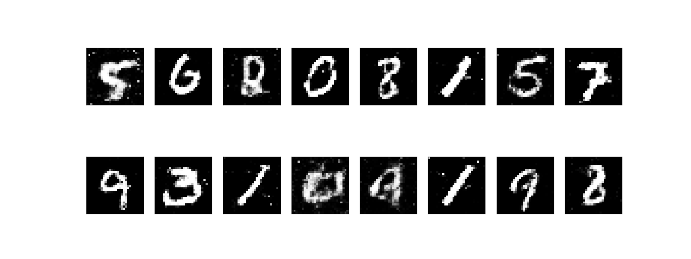
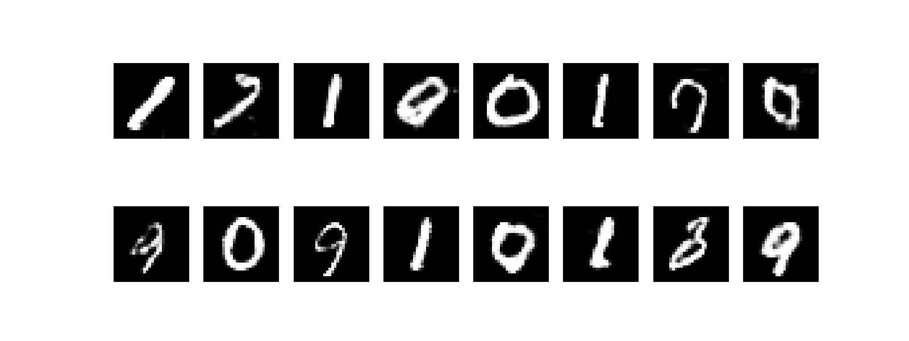
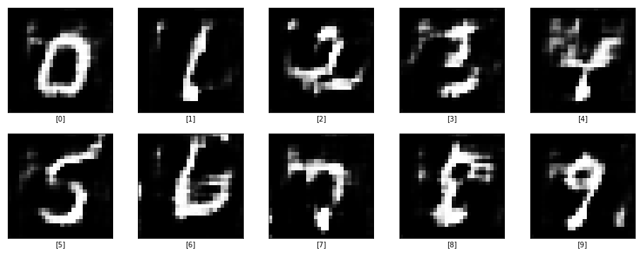
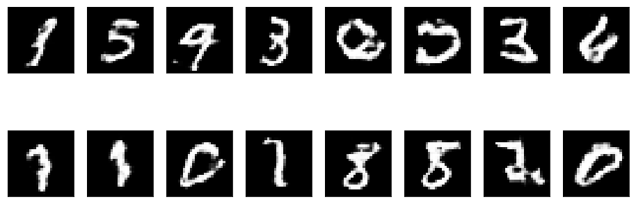
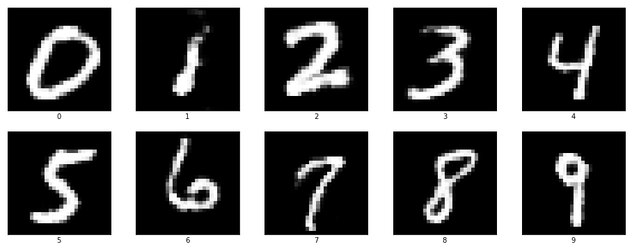

# Experiments with MNIST

### 1. [MLP-GAN](./1-MLP-GAN/)
Simple Generative Adversarial Network implemented using Multi Layered Perceptrons and trained on the MNIST dataset. The model can be generated by running the notebooks in the [notebooks](./1-MLP-GAN/notebooks/) folder. To test the pre-trained model run the `test_model.py` script.

Kaggle Kernel Link: [https://www.kaggle.com/soumikrakshit/generative-adversarial-network-in-tensorflow](https://www.kaggle.com/soumikrakshit/generative-adversarial-network-in-tensorflow)

### 2. [DCGAN](./2-DCGAN/)
Generative Adversarial Network implemented using Deep Convolutional Networks and trained on the MNIST dataset. The model can be generated by running the notebooks in the [notebooks](./2-DCGAN/notebooks/) folder. To test the pre-trained model run the `test_model.py` script.

Kaggle Kernel Link: [https://www.kaggle.com/soumikrakshit/dcgan-in-tensorflow](https://www.kaggle.com/soumikrakshit/dcgan-in-tensorflow)

### 3. [ACGAN](./3-ACGAN/)
Auxiliary Classifier Generative Adversarial Network implemented using Deep Convolutional Networks and trained on the MNIST dataset. The model can be generated by running the notebooks in the [notebooks](./3-ACGAN/notebooks/) folder. To test the pre-trained model run the `test_model.py` script.

Kaggle Kernel Link: [https://www.kaggle.com/soumikrakshit/auxiliary-classifier-gan](https://www.kaggle.com/soumikrakshit/auxiliary-classifier-gan)

### 4. [WGAN](./4-WGAN/)
Generative Adversarial Network implemented using Deep Convolutional Networks and Wassertein's Loss Function trained on the MNIST dataset. The model can be generated by running the notebooks in the [notebooks](./4-WGAN/notebooks/) folder. To test the pre-trained model run the `test_model.py` script.

Kaggle Kernel Link: [https://www.kaggle.com/soumikrakshit/wassertein-gan](https://www.kaggle.com/soumikrakshit/wassertein-gan)

### 5. [CDCGAN](./4-WGAN/)
Conditional Generative Adversarial Network implemented using Deep Convolutional Networks trained on the MNIST dataset. The model can be generated by running the notebooks in the [notebooks](./5-CDCGAN/notebooks/) folder. To test the pre-trained model run the `test_model.py` script.

Kaggle Kernel Link: [https://www.kaggle.com/soumikrakshit/conditional-dcgan](https://www.kaggle.com/soumikrakshit/conditional-dcgan)

