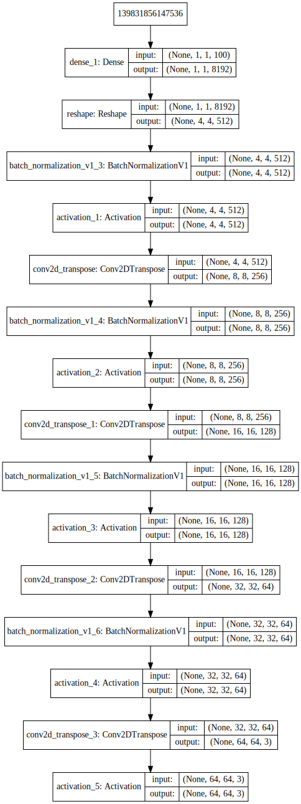
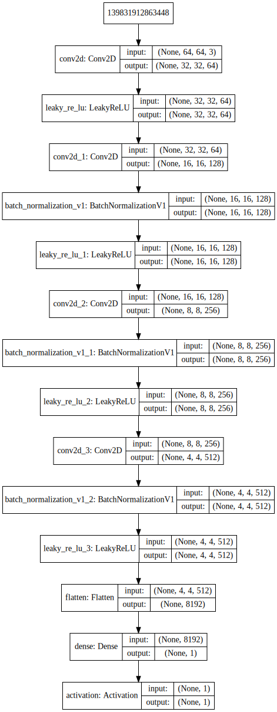
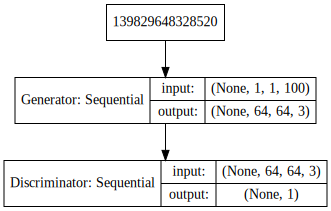
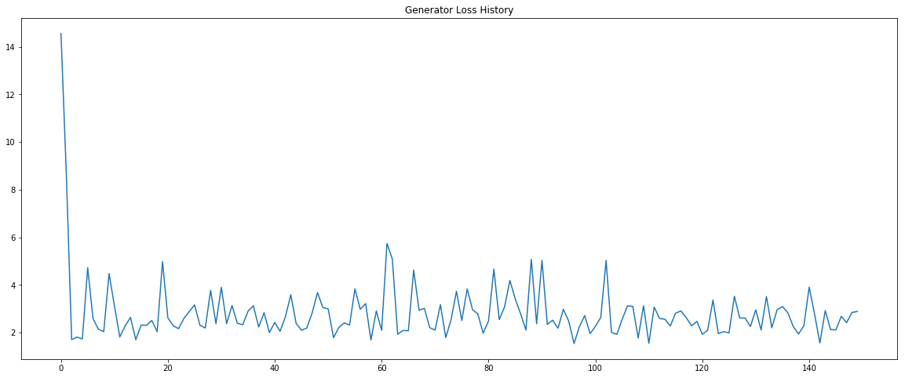

# AnimeGAN
A Deep Convolutional Generative Adversarial Network to generate Faces of Anime Characters

**Kaggle Notebook Link:** [https://www.kaggle.com/soumikrakshit/animegan](https://www.kaggle.com/soumikrakshit/animegan)

**Dataset Link:** [https://www.kaggle.com/soumikrakshit/anime-faces](https://www.kaggle.com/soumikrakshit/anime-faces)

## Dataset Sample

## AnimeGAN Architecture

AnimeGAN is based on the standard DCGAN architecture by Alec Radford, Luke Metz, Soumith Chintala. It mainly comprises of convolution layers without max pooling and fully connected layers. It uses convolutional stride and transposed convolution for the downsampling and the upsampling.

### Generator Architecture

### Discriminator Architecture

### Final Model

## Training AnimeGAN

The AnimeGAN was trained on 21551 anime face images from size `(64, 64)` and was trained for 15000 epochs for a batch size of 32 images using Nvidia Tesla K80 GPU in the Kaggle Kernel environment.

## Training Results

