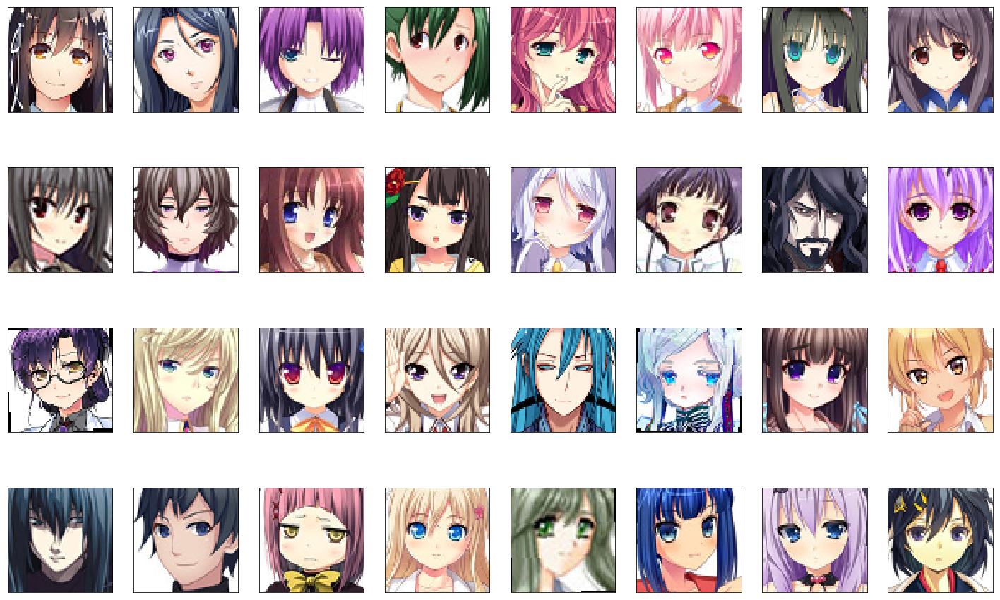
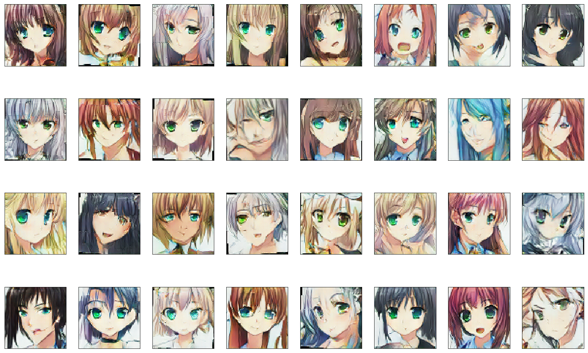

# Relativistic AnimeGAN
A Deep Convolutional Generative Adversarial Network with a Relativistic Discriminator to generate Faces of Anime Characters.

**Kaggle Notebook Link:** [https://www.kaggle.com/soumikrakshit/relativistic-anime-gan](https://www.kaggle.com/soumikrakshit/relativistic-anime-gan)

**Dataset Link:** [https://www.kaggle.com/soumikrakshit/anime-faces](https://www.kaggle.com/soumikrakshit/anime-faces)

## Dataset Sample

## AnimeGAN Architecture

Relativistic AnimeGAN is based on the concept of Relativistic Discriminator for a Deep Convolutional GAN proposed by Alexia Jolicoeur-Martineau.

## Training Relativistic AnimeGAN

The Relativistic AnimeGAN was trained on 21551 anime face images from size `(64, 64)` and was trained for 300 epochs for a batch size of 32 images using Nvidia Tesla K80 GPU in the Kaggle Kernel environment.

## Training Results

