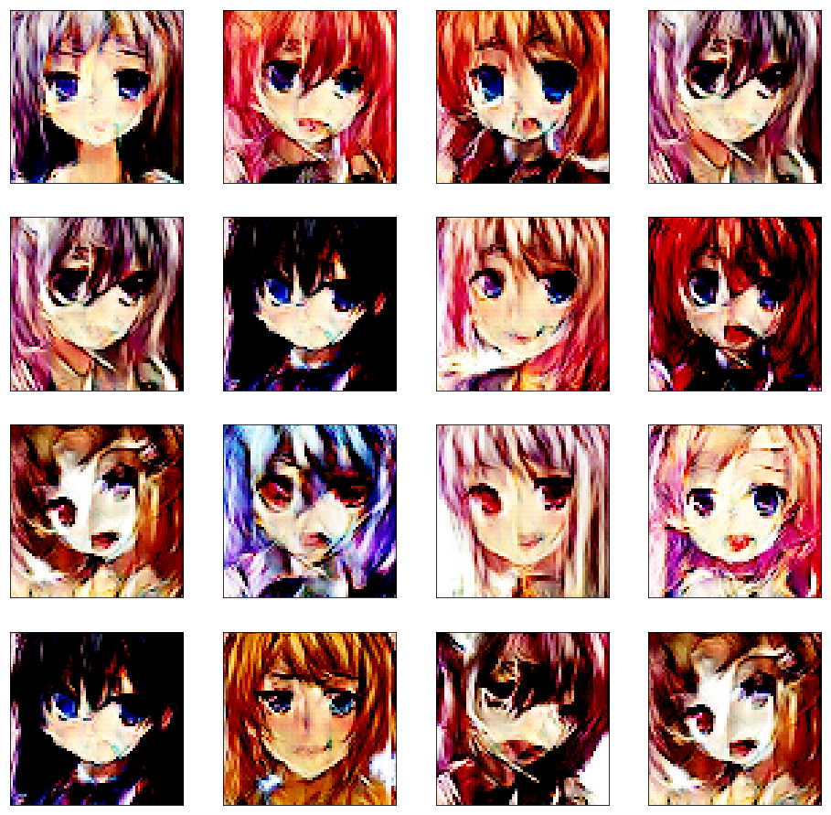

# Adventures With GANs
A repository showcasing implementations of various Generative Adversarial Network Architectures along with some of their interesting and funny usecases.

## Generating Anime Faces

**Dataset Sample:**

**Deep Convolutional AnimeGAN Results**

**Relativistic AnimeGAN Results**

